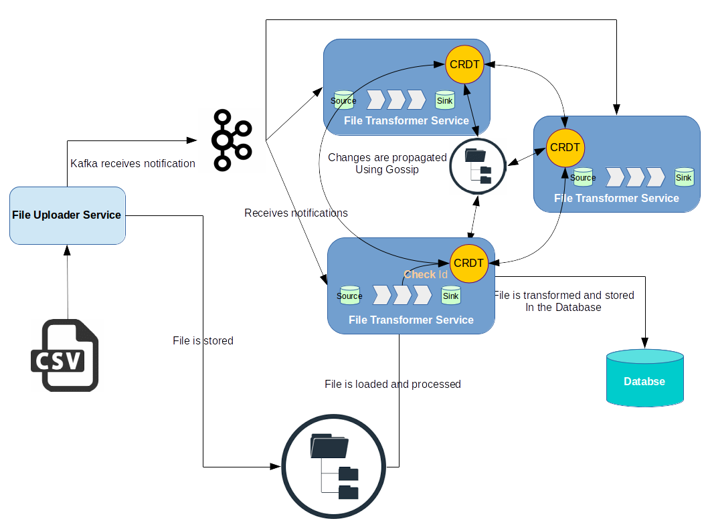

Scala Microservices
===================

A simple demonstration of Microservices in Scala. 

It supports the following :

 - RESTful endpoints
 - Reactive Streams
 - Akka Distributed Data
 
Introduction
------------
In this project I  have mainly focused on "Removing the duplicate values" part of the assignment, because
I believe it's a major issue in most microservices.
 
To scale up the project we have to be able to run multiple instances of a certain service to balance the load.
Also each service runs completely isolated and even may have it's own data store, but in some cases they 
need to share some state with each other or at least be aware of each other.

In this project each instance of **"file-transformer-service"** may process a different file. Each instance of service 
may face some records which were processed by other services. As a result, those records should be omitted. 
To achieve this goal I came up with a solution which is implemented using [Akka Distributed Data](http://doc.akka.io/docs/akka/2.4.17/scala/distributed-data.html).

*Akka Distributed Data* is useful when you need to share data between nodes in an Akka Cluster.
The data is accessed with an actor providing a key-value store like API.
The keys are unique identifiers with type information of the data values.
The values are Conflict Free **Replicated Data Types** (CRDTs).

All data entries are spread to all nodes, in the cluster via direct replication and gossip based dissemination.
You have fine grained control of the consistency level for reads and writes.

The nature CRDTs makes it possible to perform updates from any node without coordination.
Concurrent updates from different nodes will automatically be resolved by the monotonic merge function, which all data types must provide.
The state changes always converge.
 
It is eventually consistent and geared toward providing high read and write availability (partition tolerance), with low latency. 

I have implemented my own custom data type named [BloomDataType](file-transformer-service/src/main/scala/akka/cluster/ddata/BloomDataType.scala). It uses **BloomFilter** as it's underlying data structure.
A Bloom filter is a space-efficient probabilistic data structure, that is used to test whether an element is a member of a set. 

Before *Distributed Data* is born, I had the same idea and implemented a simple project called [Dibis](https://github.com/EtaCassiopeia/Dibis) two years ago.

The data types must be serializable with an Akka Serializer.Therefore, I implemented 
an efficient serialization with **Protobuf** for my custom data type([BloomDataSerializer](file-transformer-service/src/main/scala/akka/cluster/ddata/BloomDataSerializer.scala)).
  
By default the data is only kept in memory. It is redundant since it is replicated to other nodes in the cluster,
but if you stop all nodes the data is lost, unless you have saved it elsewhere.

Entries can be configured to be durable, i.e. stored on local disk on each node. 
The stored data will be loaded next time the replicator is started, i.e. when actor system is restarted.
This means data will survive as long as at least one node from the old cluster takes part in a new cluster.
I have used **LMDB** as the default storage implementation to store serialized copy of the Bloom Filter on disk.

To add this custom filtering mechanism I have used *Implicit Conversions* which can be found in [ExtendedSource](file-transformer-service/src/main/scala/dedup/ExtendedSource.scala) class.
  


project structure
-----------------
This project consists of two main services:
* **file-uploader-service:**
    This service exposes an endpoint for the file upload(.CSV). Once the file is uploaded it should be saved in the file system, under a
    configurable directory and notify *file-transformer-service* to process the file.
* **file-transformer-service:**
    Immediate to the file upload, this service be notified, which in turn loads the file and applies the business logic over
    it. At the end the final results be stored in a Database.

communication mechanism for two services is implemented using **Kafka**. I have chosen **Reactive Stream**s to implement
[EventConsumer](file-transformer-service/src/main/scala/messaging/EventConsumer.scala) and [FileTransformer](file-transformer-service/src/main/scala/transfer/FileTransformer.scala) components.    

Requirements
------------

1. [sbt 0.13.x](http://www.scala-sbt.org/download.html)
2. Java 7+

Configuration
-------------

The minimum required configuration is the kafka *bootstrap.servers* which is used for connecting to the Kafka.
This can be found in the application.conf file in conf directory:

```
kafka.bootstrap.servers = "localhost:9092"    
```      

Alternatively, use the run-time environment variable if you don't want to hardcode any values:

```
-Dkafka.bootstrap.servers = "localhost:9092"    
```      


Compile
-------

The command below will download all required dependencies and compile the project:

```
sbt clean compile
```

Starting required tools
-----------------------

This application uses **Kafka**. Therefore, you need a running instance of Kafka and obviously Zookeeper. you can use
a Docker image to start both tools at the same time. You can pull and start [spotify-kafka](https://hub.docker.com/r/spotify/kafka/)
for this purpose.

Starting the service
--------------------

First of all you need to start an instance of *file-uploader-service*. 

```bash
sbt "project fileUploaderService" run
```

above command will create an instance of *file-uploader-service* which will listen on port 9000.

To start an instance of *file-transformer-service* you can use below command:

```bash
sbt "project fileTransformerService" run -Dakka.remote.netty.tcp.port=2551
```

if you want to start more instances of this service you have to change port number or ip address of the service.
you can use command line switches to set port/ip of this service:

```bash
sbt "project fileTransformerService" run -Dakka.remote.netty.tcp.port=2552
```

Note that to have some active instances of this service you need to have more than one *Partition* on *Kafka* *Topic* because
each *Partition* could be consume just by one consumer at each *Consumer-Group**.

Be aware that if one of the services encounter problem and be terminated unexpectedly, another instance is able to
resume the process but it needs at least 10 seconds to do this. It is a Kafka related configuration and
can be set using *session.timeout.ms* attribute. 
If no heartbeats are received by the broker before the expiration of this session timeout, 
then the broker will remove this consumer from the group and initiate a rebalance and reassign the partition 
to another consumer in a consumer group.


And finally to upload a file you can use **curl**:

```bash
curl -F "name=@data_test.zip" http://localhost:9000/upload
```

You may noticed that I used a **zip** file. To decrease file upload size I prefer a compressed file instead of 
a flat and uncompressed text file.

After uploading the file, a message will publish to **event** topics on kafka. And then *file-transformer-service*
will be notified and will start to process file.

Each *Id* which is visited from any instance of service will be added to the *Bloom Filter* and this event 
will be propagated to other instances of the service.

After processing records they will be stored on an *in-memory* database. Therefore, each instance of service 
 may have just some part of data which is not durable too. This have to be changed in the Production profile.